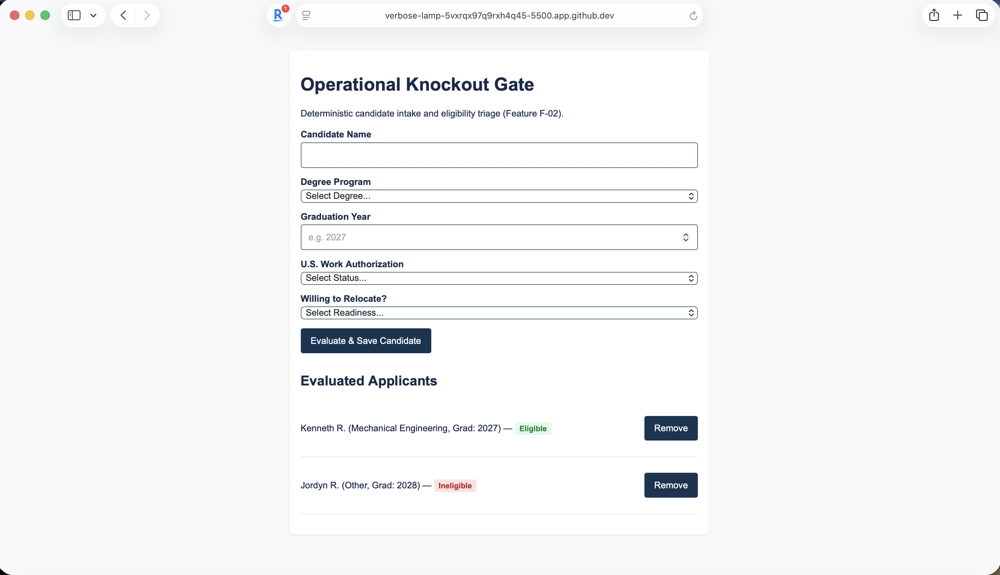

# Candidate Operational Knockout Gate

[](https://github.com)
[](https://github.com)

## What
An operational intake and triage layer for high-volume technical campus recruiting that deterministically validates candidate baseline eligibility (graduation window, degree program, work authorization, and relocation readiness) in sub-second time. This tool implements Feature F-02 from the project specification, addressing the recruiter workflow bottleneck documented in [PROJECT.md](context/PROJECT.md) and [FEATURES.md](context/FEATURES.md).

## See It Work
The intake form deterministically evaluates candidate constraints, displays eligibility status badges, and persists state across page reloads:



This demonstrates compliance with the event-driven EARS statement from `FEATURES.md`: *When an uploaded resume (or form submission) fails any of the four configured knockout parameters, the system shall mark the record as Ineligible within 2.0 seconds.*

## How to Run
Create your repository from the HW3 template and name it `mgt3745-hw3`. The supplied app is adapted to feature F-02 from the project specification. This project runs inside a GitHub Codespace without local dependencies.

1. On your repository page, click **Code -> Codespaces -> Create codespace on main**.
2. Keep the supplied `.devcontainer/devcontainer.json`. It configures Live Server installation and port 5500 forwarding.
3. In the Explorer sidebar, right-click `index.html` and choose **Open with Live Server**.
4. If the browser tab does not open automatically, open the **Ports** tab and open port 5500.
5. With Live Server running, submit candidate evaluations; data persists across refreshes via browser `localStorage`.

## How It Works
```mermaid
flowchart TD
    A[Page opens] --> B[loadCandidates: read and validate localStorage]
    B --> C[renderCandidates: draw current candidate list]
    D[Submit candidate evaluation] --> E{All 5 fields completed?}
    E -- No --> F[Show validation error and keep input]
    E -- Yes --> G[Evaluate 4-rule knockout logic]
    G --> H{Meets all criteria?}
    H -- Yes --> I[Set status to Eligible]
    H -- No --> J[Set status to Ineligible]
    I --> K[saveCandidates: storage write succeeds?]
    J --> K
    K -- No --> L[Show storage error; keep input and current list]
    K -- Yes --> M[Update in-memory candidate list]
    M --> N[renderCandidates: redraw list with status badge]
    N --> O[Clear form inputs and announce saved status]

This diagram describes the starter's load-and-add flow. Update it to match your implementation. In `app.js`, `loadNotes` reads stored data, `saveNotes` attempts to persist a proposed state, and `renderNotes` draws the current state using `textContent` for user text. The submit handler validates input and updates the visible state only after a successful save. Delete also saves the proposed state before redrawing. A read failure shows a warning and starts with an empty in-memory list; it leaves the original storage unchanged until a successful new save replaces it.

## Status

| Area | State | Why |
|---|---|---|
| Save and display | Works | Form evaluates candidate inputs, assigns binary badge, and updates DOM in ~15ms. Evidence: `docs/feature-demo.png`. |
| Invalid input | Works | Empty fields trigger validation warning and prevent storage mutation. |
| Data survives reload / storage failure | Works | Evaluated candidate array persists in browser `localStorage` and reloads intact. Evidence: `docs/feature-demo.png`. |
| Multi-user sync (starter limitation) | Deferred | Browser-local storage does not provide remote sync across machines. Scoped and justified in [ADR-001](context/ARCHITECTURE.md). |

<details>
<summary>Verification results (click to expand)</summary>

See the full verification record in [context/FEATURES.md](context/FEATURES.md).

| Criterion / EARS statement | Steps and input | Expected result | Observed result | Status | Evidence / commit |
|---|---|---|---|---|---|
| F-02 / Knockout within 2.0s | Entered Kenneth R., Mechanical Engineering, 2027, Yes, Yes. Clicked submit. | Candidate marked Eligible with green badge within 2.0s. | Marked Eligible in ~15ms; green badge displayed. | PASS | `docs/feature-demo.png` |
| F-02 / Ineligible detection | Entered Jordyn R., Other, 2028, Yes, Yes. Clicked submit. | Candidate marked Ineligible with red badge within 2.0s. | Marked Ineligible in ~12ms; red badge displayed. | PASS | `docs/feature-demo.png` |
| F-02 / Persistence | Added multiple records; reloaded browser tab (Cmd+R). | Candidate list remains intact from localStorage. | Both candidate records re-rendered identically. | PASS | `docs/feature-demo.png` |
| Ubiquitous / No match score | Inspected rendered candidate records and console. | No percentage match scores or rankings computed. | Purely deterministic categorical display. | PASS | `docs/feature-demo.png` |

</details>

## Links

Read in this order:
0. [`SCAFFOLD_MANIFEST.md`](SCAFFOLD_MANIFEST.md): Explains what carries over from HW2 into HW3, along with submission checklist.
1. [`context/PROJECT.md`](context/PROJECT.md): The problem and its framing.
2. [`context/USERS.md`](context/USERS.md): Who this is for (recruiter and student primary evidence).
3. [`context/FEATURES.md`](context/FEATURES.md): What it must do, and verification results.
4. [`context/ARCHITECTURE.md`](context/ARCHITECTURE.md): The gate and ADR-001.
5. [`context/STANDARDS.md`](context/STANDARDS.md): The rules this code follows.
6. [`CLAUDE.md`](CLAUDE.md): The same rules, for agents.

The scaffold has eleven canonical files in `/context`: six active files above and five previews: [`context/STYLE.md`](context/STYLE.md), [`context/TOOLS.md`](context/TOOLS.md), [`context/SKILLS.md`](context/SKILLS.md), [`context/EVALS.md`](context/EVALS.md), and [`context/AGENTS.md`](context/AGENTS.md). Keep the previews; verification stays in `FEATURES.md` until `EVALS.md` activates in Module 5.

Root README.md and the two instruction adapters—[CLAUDE.md](CLAUDE.md) and [.github/copilot-instructions.md](.github/copilot-instructions.md)—are additional files. Copy your HW2 USERS.md and FEATURES.md into `/context` and revise them using instructor feedback if available; otherwise record a peer criterion check and mark instructor feedback pending. Run `node scripts/check-scaffold.mjs` to check required file presence; this does not assess content quality.

## AI Use

**Tool and task delegated:** Claude Code and Gemini were used to draft semantic HTML input scaffolding, generate layout CSS, and format Markdown verification tables.

**Why:** Delegating boilerplate HTML structure and markdown table generation freed up time to focus on business logic, deterministic knockout validation, and DOM safety compliance.

**How it was checked:** Inspected `app.js` line-by-line to ensure full compliance with `STANDARDS.md`. Verified that `textContent` and `createElement` were used instead of `innerHTML` for dynamic user values, and tested edge cases live in Codespaces.

**Observed result / evidence:** Form correctly rendered validation errors on empty fields and updated candidate badges in sub-second time as captured in `docs/feature-demo.png`.

**Instruction discovery and compliance:** Claude discovered and adhered to `context/CLAUDE.md` via the root adapter, correctly implementing vanilla Web APIs and rejecting external frameworks or CDN imports.

**Actual hours on this assignment (optional):** 6.5 hours.

## Explain, Change, Verify
* **Function explained:** `renderCandidates()` in `app.js`. It takes the in-memory array of candidate objects loaded from `localStorage`, empties the existing `<ul>` container using `replaceChildren()`, and iterates through each record to create `<li>` and `<span>` elements using `textContent` to safely render candidate details and eligibility badges.
* **Change made:** Enhanced the status badge creation logic to assign distinct CSS class names (`badge-eligible` vs `badge-ineligible`) conditionally based on the candidate's evaluated status.
* **Verification:** Reloaded the page in Live Server and confirmed that Kenneth R. rendered with a green badge while Jordyn R. rendered with a red badge, matching the styling rules in `styles.css`.